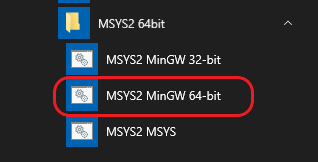

# Build QEMU with enabled Hyper-v acceleration (WHPX) on Windows


<p align="center"></p>


## Windows Hypervisor Platform
I assume you're familiar with the WHP([Windows Hypervisor Platform](https://docs.microsoft.com/en-us/virtualization/api/)), and you know how enable it, if not read this **[Install Hyper-V on Windows 10](https://docs.microsoft.com/en-us/virtualization/hyper-v-on-windows/quick-start/enable-hyper-v)**

---

## [QEMU](https://www.qemu.org/) + [WHP](https://docs.microsoft.com/en-us/virtualization/) 

There is two way to build QEMU for windows:

  **1 -** Use a Linux machine and cross-compiling using MinGW compiler.
  
  **2 -** Use MSYS2/MinGW on Windows.
 
As the title implies our choose is number two, so we're going to build QEMU(At this time version [4.1.0](https://github.com/qemu/qemu/releases/tag/v4.1.0)) from source with enabled Hyper-v acceleration (WHPX) on Windows 10

## Requirements

- **[MSYS2](https://www.msys2.org)**
- **[Windows 10 SDK](https://developer.microsoft.com/en-us/windows/downloads/windows-10-sdk)** 

**Note :**
Installation of **Windows SDK 10** is not necessary, so you only need these three header files listed bellow.
It depends on you to install the whole SDK or just copy the header files form another source.


> WinHvEmulation.h

> WinHvPlatform.h

> WinHvPlatformDefs.h

---


## Start the MSYS2 environment :
<p align="left"></p>
<!--  -->

## Install the MSYS/MinGW 64-bit required packages:
```bash

# Upgrade installed packages
pacman -Suy --noconfirm

# Install basic packets
# You can only install [make pkg-config bison diffutils] packages instead of the whole base-devel package
pacman -Sy --noconfirm base-devel mingw-w64-x86_64-gcc git python

# Install QEMU specific packets
pacman -Sy --noconfirm mingw-w64-x86_64-glib2 mingw-w64-x86_64-gtk3 mingw-w64-x86_64-SDL2
  
```
**\***  You can obtain more information about each package by using `pacman -Q --info PACKAGE_NAME` command.


## Clone the QEMU git repository after the MSYS/MinGW toolchain prepared:
```bash
git clone git://git.qemu.org/qemu.git
cd qemu
git submodule init
git submodule update --recursive
```

## Copy the required header files of WHP from Windows SDK to the MinGW toolchain:

As I mentioned before you don't have to install the **Windows SDK** you just need three header files, anyway if you have the **Windows SDK** installed, you may have multiple versions of it.
With the following **powershell** command you can simple get list of all **Windows SDK**s were already installed on your machine.

```powershell
Get-ChildItem "HKLM:\SOFTWARE\Wow6432Node\Microsoft\Windows Kits\Installed Roots"
```

```powershell
PS C:\Users\UserName> Get-ChildItem "HKLM:\SOFTWARE\Wow6432Node\Microsoft\Windows Kits\Installed Roots"


    Hive: HKEY_LOCAL_MACHINE\SOFTWARE\Wow6432Node\Microsoft\Windows Kits\Installed Roots


Name                           Property
----                           --------
10.0.17134.0
10.0.17763.0
10.0.18362.0

```

After you choose your target SDK version just run this command with your SDK version! to copy the header files to **MinGW** setup

```bash
cp /c/Program\ Files\ \(x86\)/Windows\ Kits/10/Include/10.0.17763.0/um/WinHv*\
 /mingw64/x86_64-w64-mingw32/include/
```

## Configure the build system:

In this example I just built the QEMU with my minimum requirements, you can see more options by running this command `$ ./configure --help`

<details><summary>Show All Available options</summary>
<p>

```bash
$ ./configure --help

Usage: configure [options]
Options: [defaults in brackets after descriptions]

Standard options:
  --help                   print this message
  --prefix=PREFIX          install in PREFIX [c:/Program Files/QEMU]
  --interp-prefix=PREFIX   where to find shared libraries, etc.
                           use %M for cpu name [/usr/gnemul/qemu-%M]
  --target-list=LIST       set target list (default: build everything)
                           Available targets: aarch64-softmmu alpha-softmmu
                           arm-softmmu cris-softmmu hppa-softmmu i386-softmmu
                           lm32-softmmu m68k-softmmu microblazeel-softmmu
                           microblaze-softmmu mips64el-softmmu mips64-softmmu
                           mipsel-softmmu mips-softmmu moxie-softmmu
                           nios2-softmmu or1k-softmmu ppc64-softmmu ppc-softmmu
                           riscv32-softmmu riscv64-softmmu s390x-softmmu
                           sh4eb-softmmu sh4-softmmu sparc64-softmmu
                           sparc-softmmu tricore-softmmu unicore32-softmmu
                           x86_64-softmmu xtensaeb-softmmu xtensa-softmmu
  --target-list-exclude=LIST exclude a set of targets from the default target-list

Advanced options (experts only):
  --cross-prefix=PREFIX    use PREFIX for compile tools []
  --cc=CC                  use C compiler CC [cc]
  --iasl=IASL              use ACPI compiler IASL [iasl]
  --host-cc=CC             use C compiler CC [cc] for code run at
                           build time
  --cxx=CXX                use C++ compiler CXX [c++]
  --objcc=OBJCC            use Objective-C compiler OBJCC [cc]
  --extra-cflags=CFLAGS    append extra C compiler flags QEMU_CFLAGS
  --extra-cxxflags=CXXFLAGS append extra C++ compiler flags QEMU_CXXFLAGS
  --extra-ldflags=LDFLAGS  append extra linker flags LDFLAGS
  --cross-cc-ARCH=CC       use compiler when building ARCH guest test cases
  --cross-cc-flags-ARCH=   use compiler flags when building ARCH guest tests
  --make=MAKE              use specified make [make]
  --install=INSTALL        use specified install [install]
  --python=PYTHON          use specified python [python3]
  --smbd=SMBD              use specified smbd [/usr/sbin/smbd]
  --with-git=GIT           use specified git [git]
  --static                 enable static build [no]
  --mandir=PATH            install man pages in PATH
  --datadir=PATH           install firmware in PATH
  --docdir=PATH            install documentation in PATH
  --bindir=PATH            install binaries in PATH
  --libdir=PATH            install libraries in PATH
  --libexecdir=PATH        install helper binaries in PATH
  --sysconfdir=PATH        install config in PATH
  --localstatedir=PATH     install local state in PATH (set at runtime on win32)
  --firmwarepath=PATH      search PATH for firmware files
  --with-confsuffix=SUFFIX suffix for QEMU data inside datadir/libdir/sysconfdir []
  --with-pkgversion=VERS   use specified string as sub-version of the package
  --enable-debug           enable common debug build options
  --enable-sanitizers      enable default sanitizers
  --disable-strip          disable stripping binaries
  --disable-werror         disable compilation abort on warning
  --disable-stack-protector disable compiler-provided stack protection
  --audio-drv-list=LIST    set audio drivers list:
                           Available drivers: dsound sdl
  --block-drv-whitelist=L  Same as --block-drv-rw-whitelist=L
  --block-drv-rw-whitelist=L
                           set block driver read-write whitelist
                           (affects only QEMU, not qemu-img)
  --block-drv-ro-whitelist=L
                           set block driver read-only whitelist
                           (affects only QEMU, not qemu-img)
  --enable-trace-backends=B Set trace backend
                           Available backends: dtrace ftrace log simple syslog ust
  --with-trace-file=NAME   Full PATH,NAME of file to store traces
                           Default:trace-<pid>
  --disable-slirp          disable SLIRP userspace network connectivity
  --enable-tcg-interpreter enable TCG with bytecode interpreter (TCI)
  --enable-malloc-trim     enable libc malloc_trim() for memory optimization
  --oss-lib                path to OSS library
  --cpu=CPU                Build for host CPU [x86_64]
  --with-coroutine=BACKEND coroutine backend. Supported options:
                           ucontext, sigaltstack, windows
  --enable-gcov            enable test coverage analysis with gcov
  --gcov=GCOV              use specified gcov [gcov]
  --disable-blobs          disable installing provided firmware blobs
  --with-vss-sdk=SDK-path  enable Windows VSS support in QEMU Guest Agent
  --with-win-sdk=SDK-path  path to Windows Platform SDK (to build VSS .tlb)
  --tls-priority           default TLS protocol/cipher priority string
  --enable-gprof           QEMU profiling with gprof
  --enable-profiler        profiler support
  --enable-debug-stack-usage
                           track the maximum stack usage of stacks created by qemu_alloc_stack

Optional features, enabled with --enable-FEATURE and
disabled with --disable-FEATURE, default is enabled if available:

  system          all system emulation targets
  user            supported user emulation targets
  linux-user      all linux usermode emulation targets
  bsd-user        all BSD usermode emulation targets
  docs            build documentation
  guest-agent     build the QEMU Guest Agent
  guest-agent-msi build guest agent Windows MSI installation package
  pie             Position Independent Executables
  modules         modules support (non-Windows)
  debug-tcg       TCG debugging (default is disabled)
  debug-info      debugging information
  sparse          sparse checker

  gnutls          GNUTLS cryptography support
  nettle          nettle cryptography support
  gcrypt          libgcrypt cryptography support
  auth-pam        PAM access control
  sdl             SDL UI
  sdl-image       SDL Image support for icons
  gtk             gtk UI
  vte             vte support for the gtk UI
  curses          curses UI
  iconv           font glyph conversion support
  vnc             VNC UI support
  vnc-sasl        SASL encryption for VNC server
  vnc-jpeg        JPEG lossy compression for VNC server
  vnc-png         PNG compression for VNC server
  cocoa           Cocoa UI (Mac OS X only)
  virtfs          VirtFS
  mpath           Multipath persistent reservation passthrough
  xen             xen backend driver support
  xen-pci-passthrough    PCI passthrough support for Xen
  brlapi          BrlAPI (Braile)
  curl            curl connectivity
  membarrier      membarrier system call (for Linux 4.14+ or Windows)
  fdt             fdt device tree
  bluez           bluez stack connectivity
  kvm             KVM acceleration support
  hax             HAX acceleration support
  hvf             Hypervisor.framework acceleration support
  whpx            Windows Hypervisor Platform acceleration support
  rdma            Enable RDMA-based migration
  pvrdma          Enable PVRDMA support
  vde             support for vde network
  netmap          support for netmap network
  linux-aio       Linux AIO support
  cap-ng          libcap-ng support
  attr            attr and xattr support
  vhost-net       vhost-net kernel acceleration support
  vhost-vsock     virtio sockets device support
  vhost-scsi      vhost-scsi kernel target support
  vhost-crypto    vhost-user-crypto backend support
  vhost-kernel    vhost kernel backend support
  vhost-user      vhost-user backend support
  spice           spice
  rbd             rados block device (rbd)
  libiscsi        iscsi support
  libnfs          nfs support
  smartcard       smartcard support (libcacard)
  libusb          libusb (for usb passthrough)
  live-block-migration   Block migration in the main migration stream
  usb-redir       usb network redirection support
  lzo             support of lzo compression library
  snappy          support of snappy compression library
  bzip2           support of bzip2 compression library
                  (for reading bzip2-compressed dmg images)
  lzfse           support of lzfse compression library
                  (for reading lzfse-compressed dmg images)
  seccomp         seccomp support
  coroutine-pool  coroutine freelist (better performance)
  glusterfs       GlusterFS backend
  tpm             TPM support
  libssh          ssh block device support
  numa            libnuma support
  libxml2         for Parallels image format
  tcmalloc        tcmalloc support
  jemalloc        jemalloc support
  avx2            AVX2 optimization support
  replication     replication support
  opengl          opengl support
  virglrenderer   virgl rendering support
  xfsctl          xfsctl support
  qom-cast-debug  cast debugging support
  tools           build qemu-io, qemu-nbd and qemu-img tools
  vxhs            Veritas HyperScale vDisk backend support
  bochs           bochs image format support
  cloop           cloop image format support
  dmg             dmg image format support
  qcow1           qcow v1 image format support
  vdi             vdi image format support
  vvfat           vvfat image format support
  qed             qed image format support
  parallels       parallels image format support
  sheepdog        sheepdog block driver support
  crypto-afalg    Linux AF_ALG crypto backend driver
  capstone        capstone disassembler support
  debug-mutex     mutex debugging support
  libpmem         libpmem support

NOTE: The object files are built at the place where configure is launched
```
</p>
</details>

___


**Note:**
Unfortunately in QEMU version 4.1.50 (Latest version of it's git repository at this time) there is some errors when you try `--enable-whpx` option. You must add this line `#include "hw/boards.h"` to `whpx-all.c` file `qemu/target/i386/whpx-all.c` then it will compile flawlessly. 
This problem doesn't exist on version 4.1.0 `qemu-4.1.0.tar.xz`

<!-- It's strange because this problem only exist in the code that cloned from git not the `qemu-4.1.0.tar.xz` source code, the repo is update but this is what it is🤷🏻‍

> **Left**  : qemu-4.1.0.tar.xz             
> **Right** :  git://git.qemu.org/qemu.git

 -->


You can specify your Build directory for binary files through `--prefix=` option, in this example I passed the `../../QEMU-4.1.0-bin` directory to it, so after you run `make install` it will put all binary files in this directory for you. It's a good idea to use a variable instead of hardcoding it evrywhere (E.g. `BUILD_PATH=$HOME/QEMU-4.1.0-bin/`)

```bash
BUILD_PATH=$HOME/QEMU-4.1.0-bin/
```
```bash
mkdir build
cd build
../configure \
 --prefix=$BUILD_PATH\
 --target-list=x86_64-softmmu,i386-softmmu\
 --enable-whpx\
 --enable-tools\
 --enable-lzo\
 --enable-bzip2\
 --enable-sdl \
 --enable-gtk\
 --enable-vdi \
 --enable-qcow1\
 --enable-hax\
 --disable-capstone 
```


<details><summary>Show used options descriptions</summary>
<p>

```
# whpx            Windows Hypervisor Platform acceleration support

# tools           build qemu-io, qemu-nbd and qemu-img tools
# lzo             support of lzo compression library
# bzip2           support of bzip2 compression library (for reading bzip2-compressed dmg images)
# sdl             SDL UI
# gtk             gtk UI
# hax             HAX acceleration support
# vdi             vdi image format support
# qcow1           qcow v1 image format support
# capstone        capstone disassembler support
```
</p>
</details>


## Build and Install(Copy the binary files):

Start the build process
```bash
make -j
```

After the build process finished run this commands to copy all binary files to your build directory

```bash
BUILD_PATH=$HOME/QEMU-4.1.0-bin/
```

```bash
mkdir $BUILD_PATH

make install

# Uncomment if you want exe files with debug info!
# cp x86_64-softmmu/*.exe $BUILD_PATH
# cp i386-softmmu/*.exe $BUILD_PATH


cp /mingw64/bin/{\
libatk-1.0-0.dll,\
libbz2-1.dll,\
libcairo-2.dll,\
libcairo-gobject-2.dll,\
libdatrie-1.dll,\
libepoxy-0.dll,\
libexpat-1.dll,\
libffi-6.dll,\
libfontconfig-1.dll,\
libfreetype-6.dll,\
libfribidi-0.dll,\
libgcc_s_seh-1.dll,\
libgdk_pixbuf-2.0-0.dll,\
libgdk-3-0.dll,\
libgio-2.0-0.dll,\
libglib-2.0-0.dll,\
libgmodule-2.0-0.dll,\
libgobject-2.0-0.dll,\
libgraphite2.dll,\
libgtk-3-0.dll,\
libharfbuzz-0.dll,\
libiconv-2.dll,\
libintl-8.dll,\
libjpeg-8.dll,\
liblzo2-2.dll,\
libpango-1.0-0.dll,\
libpangocairo-1.0-0.dll,\
libpangoft2-1.0-0.dll,\
libpangowin32-1.0-0.dll,\
libpcre-1.dll,\
libpixman-1-0.dll,\
libpng16-16.dll,\
libssp-0.dll,\
libstdc++-6.dll,\
libthai-0.dll,\
libwinpthread-1.dll,\
SDL2.dll,\
zlib1.dll\
} $BUILD_PATH
```
When you run `make install` it copies the binary files to build directory, but debug information and symbols are striped from these files, if you need this information just run this command to copy unmodified binary files.

```bash
cp x86_64-softmmu/*.exe $BUILD_PATH
cp i386-softmmu/*.exe $BUILD_PATH

:'
x86_64-softmmu/*.exe
  ├───qemu-system-x86_64.exe
  └───qemu-system-x86_64w.exe

i386-softmmu/*.exe
  ├───qemu-system-i386.exe
  └───qemu-system-i386w.exe
'
```


## The End

```cmd
C:\msys64\home\UserName\QEMU-4.1.0-bin>qemu-system-x86_64.exe --version
QEMU emulator version 4.1.50 (v4.1.0-733-g89ea03a7dc-dirty)
Copyright (c) 2003-2019 Fabrice Bellard and the QEMU Project developers
```

<details><summary>Show Directory List of QEMU-4.1.0-bin</summary>
<p>

```bash
$  ls -la $BUILD_PATH
total 285581
drwxr-xr-x 1 UserName None        0 Sep 11 13:37 .
drwxr-xr-x 1 UserName None        0 Sep 11 13:36 ..
drwxr-xr-x 1 UserName None        0 Sep 11 13:35 applications
-rw-r--r-- 1 UserName None     3211 Sep 11 13:35 bamboo.dtb
-rw-r--r-- 1 UserName None   131072 Sep 11 13:35 bios.bin
-rw-r--r-- 1 UserName None   262144 Sep 11 13:35 bios-256k.bin
-rw-r--r-- 1 UserName None     9779 Sep 11 13:35 canyonlands.dtb
-rw-r--r-- 1 UserName None 67108864 Sep 11 13:35 edk2-aarch64-code.fd
-rw-r--r-- 1 UserName None 67108864 Sep 11 13:35 edk2-arm-code.fd
-rw-r--r-- 1 UserName None 67108864 Sep 11 13:35 edk2-arm-vars.fd
-rw-r--r-- 1 UserName None  3653632 Sep 11 13:35 edk2-i386-code.fd
-rw-r--r-- 1 UserName None  3653632 Sep 11 13:35 edk2-i386-secure-code.fd
-rw-r--r-- 1 UserName None   540672 Sep 11 13:35 edk2-i386-vars.fd
-rw-r--r-- 1 UserName None    42903 Sep 11 13:35 edk2-licenses.txt
-rw-r--r-- 1 UserName None  3653632 Sep 11 13:35 edk2-x86_64-code.fd
-rw-r--r-- 1 UserName None  3653632 Sep 11 13:35 edk2-x86_64-secure-code.fd
-rw-r--r-- 1 UserName None   240128 Sep 11 13:35 efi-e1000.rom
-rw-r--r-- 1 UserName None   240128 Sep 11 13:35 efi-e1000e.rom
-rw-r--r-- 1 UserName None   240128 Sep 11 13:35 efi-eepro100.rom
-rw-r--r-- 1 UserName None   238592 Sep 11 13:35 efi-ne2k_pci.rom
-rw-r--r-- 1 UserName None   238592 Sep 11 13:35 efi-pcnet.rom
-rw-r--r-- 1 UserName None   242688 Sep 11 13:35 efi-rtl8139.rom
-rw-r--r-- 1 UserName None   242688 Sep 11 13:35 efi-virtio.rom
-rw-r--r-- 1 UserName None   236032 Sep 11 13:35 efi-vmxnet3.rom
drwxr-xr-x 1 UserName None        0 Sep 11 13:35 firmware
-rw-r--r-- 1 UserName None   783724 Sep 11 13:35 hppa-firmware.img
drwxr-xr-x 1 UserName None        0 Sep 11 13:35 icons
drwxr-xr-x 1 UserName None        0 Sep 11 13:35 keymaps
-rw-r--r-- 1 UserName None     9216 Sep 11 13:35 kvmvapic.bin
-rwxr-xr-x 1 UserName None   139373 Sep 11 13:37 libatk-1.0-0.dll
-rwxr-xr-x 1 UserName None    74771 Sep 11 13:37 libbz2-1.dll
-rwxr-xr-x 1 UserName None  1015140 Sep 11 13:37 libcairo-2.dll
-rwxr-xr-x 1 UserName None    37749 Sep 11 13:37 libcairo-gobject-2.dll
-rwxr-xr-x 1 UserName None    36029 Sep 11 13:37 libdatrie-1.dll
-rwxr-xr-x 1 UserName None  1682539 Sep 11 13:37 libepoxy-0.dll
-rwxr-xr-x 1 UserName None   183228 Sep 11 13:37 libexpat-1.dll
-rwxr-xr-x 1 UserName None    34176 Sep 11 13:37 libffi-6.dll
-rwxr-xr-x 1 UserName None   294979 Sep 11 13:37 libfontconfig-1.dll
-rwxr-xr-x 1 UserName None   682123 Sep 11 13:37 libfreetype-6.dll
-rwxr-xr-x 1 UserName None   141883 Sep 11 13:37 libfribidi-0.dll
-rwxr-xr-x 1 UserName None    85136 Sep 11 13:37 libgcc_s_seh-1.dll
-rwxr-xr-x 1 UserName None   171040 Sep 11 13:37 libgdk_pixbuf-2.0-0.dll
-rwxr-xr-x 1 UserName None  1243245 Sep 11 13:37 libgdk-3-0.dll
-rwxr-xr-x 1 UserName None  1524386 Sep 11 13:37 libgio-2.0-0.dll
-rwxr-xr-x 1 UserName None  1162600 Sep 11 13:37 libglib-2.0-0.dll
-rwxr-xr-x 1 UserName None    26808 Sep 11 13:37 libgmodule-2.0-0.dll
-rwxr-xr-x 1 UserName None   318421 Sep 11 13:37 libgobject-2.0-0.dll
-rwxr-xr-x 1 UserName None   154260 Sep 11 13:37 libgraphite2.dll
-rwxr-xr-x 1 UserName None  6593944 Sep 11 13:37 libgtk-3-0.dll
-rwxr-xr-x 1 UserName None   984148 Sep 11 13:37 libharfbuzz-0.dll
-rwxr-xr-x 1 UserName None  1055522 Sep 11 13:37 libiconv-2.dll
-rwxr-xr-x 1 UserName None   135218 Sep 11 13:37 libintl-8.dll
-rwxr-xr-x 1 UserName None   638393 Sep 11 13:37 libjpeg-8.dll
-rwxr-xr-x 1 UserName None   143727 Sep 11 13:37 liblzo2-2.dll
-rwxr-xr-x 1 UserName None   260720 Sep 11 13:37 libpango-1.0-0.dll
-rwxr-xr-x 1 UserName None    71379 Sep 11 13:37 libpangocairo-1.0-0.dll
-rwxr-xr-x 1 UserName None    94480 Sep 11 13:37 libpangoft2-1.0-0.dll
-rwxr-xr-x 1 UserName None   101742 Sep 11 13:37 libpangowin32-1.0-0.dll
-rwxr-xr-x 1 UserName None   287905 Sep 11 13:37 libpcre-1.dll
-rwxr-xr-x 1 UserName None   677220 Sep 11 13:37 libpixman-1-0.dll
-rwxr-xr-x 1 UserName None   231911 Sep 11 13:37 libpng16-16.dll
-rwxr-xr-x 1 UserName None    21134 Sep 11 13:37 libssp-0.dll
-rwxr-xr-x 1 UserName None  1759933 Sep 11 13:37 libstdc++-6.dll
-rwxr-xr-x 1 UserName None    68018 Sep 11 13:37 libthai-0.dll
-rwxr-xr-x 1 UserName None    56844 Sep 11 13:37 libwinpthread-1.dll
-rw-r--r-- 1 UserName None     1024 Sep 11 13:35 linuxboot.bin
-rw-r--r-- 1 UserName None     1536 Sep 11 13:35 linuxboot_dma.bin
-rw-r--r-- 1 UserName None     1024 Sep 11 13:35 multiboot.bin
-rw-r--r-- 1 UserName None   767256 Sep 11 13:35 openbios-ppc
-rw-r--r-- 1 UserName None   382048 Sep 11 13:35 openbios-sparc32
-rw-r--r-- 1 UserName None  1593408 Sep 11 13:35 openbios-sparc64
-rw-r--r-- 1 UserName None    36888 Sep 11 13:35 opensbi-riscv32-virt-fw_jump.bin
-rw-r--r-- 1 UserName None    40968 Sep 11 13:35 opensbi-riscv64-sifive_u-fw_jump.bin
-rw-r--r-- 1 UserName None    40968 Sep 11 13:35 opensbi-riscv64-virt-fw_jump.bin
-rw-r--r-- 1 UserName None   156328 Sep 11 13:35 palcode-clipper
-rw-r--r-- 1 UserName None     9982 Sep 11 13:35 petalogix-ml605.dtb
-rw-r--r-- 1 UserName None     8259 Sep 11 13:35 petalogix-s3adsp1800.dtb
-rw-r--r-- 1 UserName None  1048576 Sep 11 13:35 ppc_rom.bin
-rw-r--r-- 1 UserName None     1536 Sep 11 13:35 pvh.bin
-rw-r--r-- 1 UserName None    67072 Sep 11 13:35 pxe-e1000.rom
-rw-r--r-- 1 UserName None    61440 Sep 11 13:35 pxe-eepro100.rom
-rw-r--r-- 1 UserName None    61440 Sep 11 13:35 pxe-ne2k_pci.rom
-rw-r--r-- 1 UserName None    61440 Sep 11 13:35 pxe-pcnet.rom
-rw-r--r-- 1 UserName None    61440 Sep 11 13:35 pxe-rtl8139.rom
-rw-r--r-- 1 UserName None    60416 Sep 11 13:35 pxe-virtio.rom
-rw-r--r-- 1 UserName None      850 Sep 11 13:35 QEMU,cgthree.bin
-rw-r--r-- 1 UserName None     1402 Sep 11 13:35 QEMU,tcx.bin
-rw-r--r-- 1 UserName None    18752 Sep 11 13:35 qemu_vga.ndrv
-rwxr-xr-x 1 UserName None    86016 Sep 11 13:35 qemu-edid.exe
-rwxr-xr-x 1 UserName None   400896 Sep 11 13:35 qemu-ga.exe
-rwxr-xr-x 1 UserName None  1538560 Sep 11 13:35 qemu-img.exe
-rwxr-xr-x 1 UserName None  1491456 Sep 11 13:35 qemu-io.exe
-rw-r--r-- 1 UserName None   154542 Sep 11 13:35 qemu-nsis.bmp
-rwxr-xr-x 1 UserName None  9132032 Sep 11 13:35 qemu-system-i386.exe
-rwxr-xr-x 1 UserName None  9132032 Sep 11 13:35 qemu-system-i386w.exe
-rwxr-xr-x 1 UserName None  9165312 Sep 11 13:35 qemu-system-x86_64.exe
-rwxr-xr-x 1 UserName None  9165312 Sep 11 13:35 qemu-system-x86_64w.exe
-rw-r--r-- 1 UserName None    42608 Sep 11 13:35 s390-ccw.img
-rw-r--r-- 1 UserName None    67232 Sep 11 13:35 s390-netboot.img
-rwxr-xr-x 1 UserName None  1275183 Sep 11 13:37 SDL2.dll
-rw-r--r-- 1 UserName None     4096 Sep 11 13:35 sgabios.bin
drwxr-xr-x 1 UserName None        0 Sep 11 13:35 share
-rw-r--r-- 1 UserName None  1667280 Sep 11 13:35 skiboot.lid
-rw-r--r-- 1 UserName None   930656 Sep 11 13:35 slof.bin
-rw-r--r-- 1 UserName None       20 Sep 11 13:35 spapr-rtas.bin
-rw-r--r-- 1 UserName None   310010 Sep 11 13:35 trace-events-all
-rw-r--r-- 1 UserName None   349148 Sep 11 13:35 u-boot.e500
-rw-r--r-- 1 UserName None   524288 Sep 11 13:35 u-boot-sam460-20100605.bin
-rw-r--r-- 1 UserName None    38400 Sep 11 13:35 vgabios.bin
-rw-r--r-- 1 UserName None    38912 Sep 11 13:35 vgabios-ati.bin
-rw-r--r-- 1 UserName None    27648 Sep 11 13:35 vgabios-bochs-display.bin
-rw-r--r-- 1 UserName None    38400 Sep 11 13:35 vgabios-cirrus.bin
-rw-r--r-- 1 UserName None    38912 Sep 11 13:35 vgabios-qxl.bin
-rw-r--r-- 1 UserName None    28160 Sep 11 13:35 vgabios-ramfb.bin
-rw-r--r-- 1 UserName None    38912 Sep 11 13:35 vgabios-stdvga.bin
-rw-r--r-- 1 UserName None    38912 Sep 11 13:35 vgabios-virtio.bin
-rw-r--r-- 1 UserName None    38912 Sep 11 13:35 vgabios-vmware.bin
-rwxr-xr-x 1 UserName None    93720 Sep 11 13:37 zlib1.dll

```
</p>
</details>

---

Written by [@rceninja](https://twitter.com/rceninja) 2019